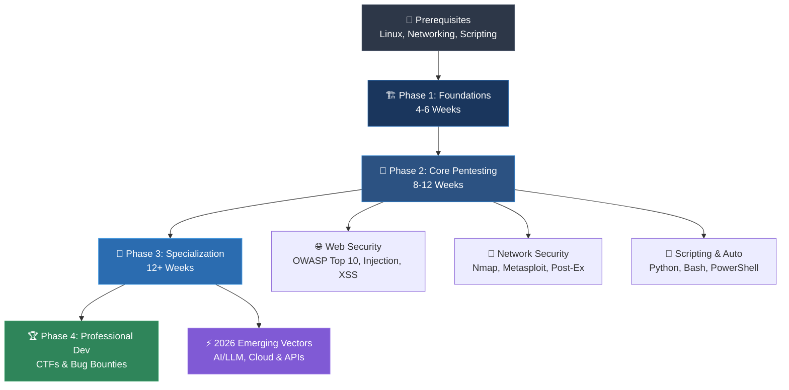

# 🎯 Penetration Testing Roadmap (2026 Edition)

<div align="center">

[](https://github.com/SagarBiswas-MultiHAT/penetration-testing-roadmap/stargazers)
[](https://github.com/SagarBiswas-MultiHAT/penetration-testing-roadmap/network/members)
[](https://github.com/SagarBiswas-MultiHAT/penetration-testing-roadmap/commits/main)
[](LICENSE)
[](CONTRIBUTING.md)
[](resources/tryhackme-rooms.md)

**A structured, comprehensive 60-week curriculum to master penetration testing, web security, network hacking, and ethical hacking from scratch.**

[📚 Explore Roadmaps](#-learning-paths--modules) • [🥽 500+ Free Labs](resources/tryhackme-rooms.md) • [🛠️ Tools Directory](resources/tools-directory.md) • [🤝 Contribute](CONTRIBUTING.md)

</div>

---

## 📖 Overview

Feeling overwhelmed by the vast world of cybersecurity? **You are not alone.** Penetration testing requires a blend of networking, Linux/Windows administration, web architecture, and security methodology. 

This repository provides a step-by-step, self-paced learning path designed to take you from absolute zero to a market-ready penetration tester through hands-on practice, vulnerable labs, real-world CTFs, and free certifications.

---

## 🗺️ Visual Learning Flowchart



---

## 📚 Learning Paths & Modules

Choose the roadmap that matches your learning style and goals:

| Module / Resource | Target Audience | Focus Area | Description |
|---|---|---|---|
| 🗺️ **[Roadmap 1: Foundations to Professional](roadmaps/roadmap-1-foundations.md)** | All Levels | Complete 60-Week Journey | Comprehensive 4-phase curriculum covering prerequisites, core pentesting, specializations, and career pathways. |
| 🧪 **[Roadmap 2: Practical Labs & Videos](roadmaps/roadmap-2-practical-labs.md)** | Hands-on Learners | Weekly Lab Schedule | 60-week breakdown with YouTube tutorials, TryHackMe labs, and detailed subpages for each week. |
| ⚡ **[Roadmap 3: 12-Week Fast Track](roadmaps/roadmap-3-goals-tasks.md)** | Accelerated Learners | 12-Week Core Sprint | High-intensity 12-week curriculum focused strictly on web application vulnerabilities and free certs. |
| 🎯 **[500+ Free TryHackMe Rooms Checklist](resources/tryhackme-rooms.md)** | Practice & CTF | Hands-on Exercises | **Featured Item:** Curated checklist of 500+ free TryHackMe labs categorized by topic. |
| 🛠️ **[Penetration Testing Tools Directory](resources/tools-directory.md)** | All Pentesters | Tool Mastery | Categorized guide to essential scanners, proxies, exploitation frameworks, and wordlists. |
| 📜 **[Certifications Guide](resources/certifications.md)** | All Learners | Career Credentials | Comprehensive guide to OSCP, Security+, eJPT, free certs (ISC2 CC, PortSwigger), and prep tips. |
| 👥 **[Community & Learning Channels](resources/community-channels.md)** | All Learners | Mentorship & Books | Recommended InfoSec books, podcasts, Discord servers, subreddits, and YouTube creators. |

---

## ⚡ What's New in the 2026 Edition?

Cybersecurity moves fast. The 2026 edition introduces modern attack vectors and defense paradigms:

* **🤖 AI & LLM Security**: Prompt injection attacks, indirect prompt hijacking, model inversion, and auditing OWASP Top 10 for LLM Applications.
* **☁️ Cloud Pentesting**: AWS/Azure/GCP identity misconfigurations, IAM privilege escalation, and container escape techniques (Docker/K8s).
* **🔌 API & Microservices**: GraphQL introspection abuse, gRPC security testing, OAuth 2.0 / JWT misconfigurations, and BOLA (Broken Object Level Authorization).
* **📦 Supply Chain & CI/CD Security**: Poisoned pipeline execution (PPE), dependency confusion, and auditing GitHub Actions workflows.
* **🛡️ Zero Trust Architecture**: Bypassing identity-aware proxies, Mutual TLS (mTLS) testing, and microsegmentation evasion.

---

## 🌟 Featured Highlight: 500+ Free TryHackMe Rooms

One of the largest open-source collections of free security labs:

```
├── 🐧 Linux Fundamentals (Part 1-3)
├── 🪟 Windows Fundamentals
├── 🔍 Reconnaissance & OSINT (Google Dorking, Shodan, Passive Recon)
├── 🌐 Web Hacking (SQLi, XSS, CSRF, SSRF, LFI/RFI, IDOR)
├── 🔐 Active Directory & Privilege Escalation
├── 🦠 Reverse Engineering & Malware Analysis
└── 🏆 200+ CTF Rooms (Easy, Medium, Hard, Insane)
```

👉 **[Access the Full Checklist & Progress Tracker](resources/tryhackme-rooms.md)**

---

## 📜 Certification & Career Roadmap

```
Entry-Level ────► Professional ────► Expert Level
  • CompTIA Sec+    • OSCP            • OSEP
  • CompTIA PenTest+ • CEH             • GPEN
  • ISC2 CC (Free)  • GCIH            • OSCE
```

👉 **[Access the Full Certifications & Career Guide](resources/certifications.md)**

---

## ⚖️ Legal & Ethical Disclaimer

> [!CAUTION]
> **Authorized Testing Only**: Penetration testing without explicit written authorization is illegal and punishable under computer crime laws (e.g., Computer Fraud and Abuse Act). Always perform testing strictly within authorized environments, lab VMs, or approved bug bounty scopes. Follow responsible disclosure practices at all times.

---

## 🤝 Contributing & Community

Contributions make this roadmap better for everyone! Whether you want to add a new TryHackMe room, fix a broken link, or translate a section:

- Read our **[CONTRIBUTING.md](CONTRIBUTING.md)** guide.
- Suggest a resource via **[Resource Suggestion Template](.github/ISSUE_TEMPLATE/resource-suggestion.md)**.
- Report dead/paywalled links via **[Broken Link Report Template](.github/ISSUE_TEMPLATE/broken-link-report.md)**.

---

<div align="center">

*Maintained with ❤️ by [@SagarBiswas-MultiHAT](https://github.com/SagarBiswas-MultiHAT) and the global InfoSec community under the [CC BY-SA 4.0 License](LICENSE).*

</div>
