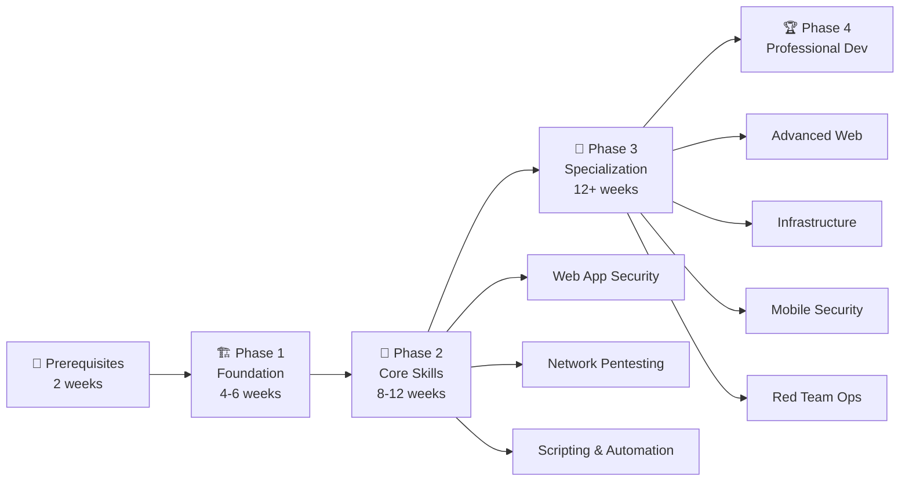

# 🚀 Growth Strategy: penetration-testing-roadmap

> **Goal**: Transform this 39-star repository into a top-trending GitHub resource for penetration testing learners.

---

## 📊 Current State Audit

| Metric | Current Value | Observation |
|---|---|---|
| Stars | 39 | Low — competitors like `sundowndev/hacker-roadmap` have thousands |
| Forks | 3 | Minimal community engagement |
| Last commit | 2026-03-08 | **4+ months stale** — signals abandonment |
| LICENSE file | ❌ Missing | Blocks adoption by organizations & educators |
| CONTRIBUTING.md | ❌ Missing | No contribution framework |
| Issue templates | ❌ Missing | No structured community input |
| GitHub Topics | ❓ Likely minimal | Limits discoverability |
| Repo description | Basic | Under-optimized for search |
| README size | 2,644 lines / 121KB | **Excessively long** — wall-of-text problem |
| Subpages content | 28 files, most < 1KB | Skeleton/stub content in many weeks |
| "My More Work" section | ~250 lines of repo cards | Dilutes focus, promotes unrelated projects |

### Key Competitors
| Repository | Stars | Differentiator |
|---|---|---|
| `sundowndev/hacker-roadmap` | 13k+ | Clean structure, tool tables, minimal |
| `carlcastanas/Cybersecurity-Roadmap` | Growing | Annually updated, covers AI security |
| `securitycipher/penetration-testing-roadmap` | Rising | Clear zero-to-junior pathway |
| `enaqx/awesome-pentest` | 22k+ | Exhaustive tool collection |
| `swisskyrepo/PayloadsAllTheThings` | 64k+ | Actionable payloads |

---

## 📋 Actionable Recommendations (Prioritized)

### PHASE 1: Fix the Foundation (Do This Week)

**1. Remove the "My More Work" portfolio section (Lines 2421-2643)**

This ~220-line block of unrelated project cards (SnakeWaterGun-Game, PyCalculator, Fake_FACEBOOK_Login_Page, etc.) severely damages credibility. Visitors arriving from search results expect a focused cybersecurity roadmap, not a personal portfolio page. This is the single most impactful deletion you can make.

> [!IMPORTANT]
> **Action**: Delete the entire `<details><summary><h2>📂 My More Work</h2></summary>` block. If you want to showcase your work, link to your GitHub profile page instead with a single line: `_Built by [@SagarBiswas-MultiHAT](https://github.com/SagarBiswas-MultiHAT) — check out my other security tools._`

---

**2. Add a LICENSE file**

Without a license, legally no one can fork, redistribute, or build upon this work. Educational roadmap repos that trend almost always use **CC BY-SA 4.0** (Creative Commons Attribution-ShareAlike) or **MIT**.

> [!TIP]
> **Action**: Create a `LICENSE` file with CC BY-SA 4.0. This explicitly invites educators, bootcamps, and content creators to use and credit your roadmap — which drives backlinks and stars.

---

**3. Split the monolithic README into a multi-file structure**

The current 2,644-line README is overwhelming. GitHub's rendering becomes sluggish on files this large, and users bounce. The most successful roadmap repos use a hub-and-spoke model.

**Proposed structure:**
```
README.md                          ← Hero page (~200 lines max)
├── roadmaps/
│   ├── roadmap-1-foundations.md    ← Current "Roadmap 1" content
│   ├── roadmap-2-practical-labs.md ← Current "Roadmap 2" content
│   └── roadmap-3-goals-tasks.md   ← Current "Roadmap 3" content
├── resources/
│   ├── tryhackme-rooms.md         ← The 502 THM rooms list (this is your crown jewel)
│   ├── tools-directory.md         ← Tool tables by category
│   ├── certifications.md          ← Cert roadmap content
│   └── community-channels.md     ← YouTube, Twitter, Discord links
├── CONTRIBUTING.md
├── LICENSE
└── .github/
    └── ISSUE_TEMPLATE/
        ├── resource-suggestion.md
        └── broken-link-report.md
```

> [!WARNING]
> **Do NOT just blindly split** — use this refactor to trim dead links, update stale references, and fill in the skeleton `Subpages/` files (many like `Week 08.md` through `Week 10.md` are only ~90 bytes of stub content).

---

**4. Rewrite the README as a compelling landing page**

The current README dumps you into `[🎯 Penetration Testing Learning Roadmap - 2 (YT Videos/Practical labs) Collected]` — an anchor link — with zero context. There is no hero banner, no "what is this repo", no star/fork badges.

**Your new README.md should contain (in order):**
1. **Hero banner** — A Mermaid diagram or ASCII art showing the learning path
2. **One-paragraph pitch** — "A structured, 60-week penetration testing curriculum with 500+ free lab exercises…"
3. **Badges row** — Stars, forks, last commit, license, contributors
4. **Visual roadmap diagram** — Mermaid flowchart of Phase 1 → Phase 2 → Phase 3 → Phase 4
5. **Quick-start table** — "Pick your level" table linking to the right roadmap file
6. **Featured highlight** — Call out the 502 free TryHackMe rooms list (this is your unique differentiator)
7. **Contributing CTA** — Link to CONTRIBUTING.md
8. **Star History chart** — Use `star-history.com` embed

---

**5. Set proper GitHub repository metadata**

On the GitHub repository settings page:

- **Description**: `🎯 A structured 60-week penetration testing curriculum with 500+ free TryHackMe labs, OWASP Top 10 deep dives, and tool mastery guides. From zero to pentester.`
- **Website**: Link to the README or a GitHub Pages site
- **Topics** (add ALL of these):
  ```
  penetration-testing, pentesting, cybersecurity, ethical-hacking,
  hacking, web-security, owasp, tryhackme, hackthebox, roadmap,
  learning-path, security-tools, bug-bounty, ctf, infosec,
  web-application-security, kali-linux, burp-suite, nmap,
  cybersecurity-roadmap, awesome-list
  ```

> [!TIP]
> GitHub Topics are the **#1 discoverability lever** you're not using. Topics are how GitHub categorizes repos for search and "Explore" recommendations. Repos tagged `awesome-list` get special treatment in GitHub's discovery engine.

---

### PHASE 2: Content Differentiation (Next 2 Weeks)

**6. Productize your 502 TryHackMe rooms list as a standalone feature**

This is your **unique selling point** — no other roadmap repo has a curated, categorized, progress-tracked list of 500+ free labs. But it's currently buried at line 248, mixed into the README.

**Action:**
- Extract it into `resources/tryhackme-rooms.md`
- Add columns: `Difficulty`, `Estimated Time`, `Free/Paid Status` (you already flag some as "no longer free" — expand this)
- Add a **completion percentage tracker** at the top using shields.io badges
- Title it: **"500+ Free TryHackMe Rooms — The Complete Checklist"**
- This file alone could generate massive traffic from Google searches like "free tryhackme rooms list"

---

**7. Add a visual Mermaid roadmap diagram**

Text-only roadmaps don't get shared on social media. Visual ones do. Add a Mermaid diagram to the README:



---

**8. Add a "2026 Edition" update with modern topics**

Your competitors (`carlcastanas/Cybersecurity-Roadmap`) are winning by adding coverage for:
- **AI/LLM security** — Prompt injection, adversarial ML
- **Cloud pentesting** — AWS/Azure/GCP-specific attack paths
- **API security** — GraphQL, gRPC, OAuth 2.0 misconfigurations
- **Supply chain attacks** — Dependency confusion, CI/CD pipeline exploitation
- **Zero Trust architecture** penetration testing

**Action**: Add a "Phase 5: Emerging Attack Surfaces (2026)" section covering these topics. Tag the commit message with `[2026 Edition]` to signal freshness.

---

**9. Fill in the skeleton Subpages**

Multiple subpages are nearly empty stubs:
- `Week 08.md` — 87 bytes
- `Week 09.md` — 88 bytes
- `Week 10.md` — 90 bytes
- `Week 39-45.md` — 229 bytes
- `Week 58-60.md` — 108 bytes

Empty content pages damage trust. Either fill them with genuine curriculum content or consolidate them into their parent roadmap file. Don't ship empty pages.

---

### PHASE 3: Community & Engagement Infrastructure (Week 3-4)

**10. Create CONTRIBUTING.md with specific, low-barrier contribution opportunities**

Make it dead-simple for anyone to contribute. Define specific tasks:
- "Add a new TryHackMe room to the list" (template provided)
- "Report a broken or paywalled link" (issue template)
- "Add a tool to the tools directory" (table format provided)
- "Share your completion timeline" (story format)
- "Translate a section" (i18n guide)

> [!TIP]
> Label issues as `good first issue` and `hacktoberfest` to drive contributor traffic during October (a massive star driver for educational repos).

---

**11. Create GitHub Issue Templates**

Add `.github/ISSUE_TEMPLATE/` with:
- **`resource-suggestion.md`** — "Suggest a new room, tool, or resource"
- **`broken-link-report.md`** — "Report a dead or paywalled link"  
- **`roadmap-feedback.md`** — "Share your learning experience"

This turns passive readers into active participants. Every issue interaction increases your repo's engagement score.

---

**12. Add a GitHub Discussions section**

Enable Discussions on the repo with categories:
- **📢 Announcements** — Roadmap updates
- **💡 Q&A** — "I'm stuck on Phase 2, what should I focus on?"
- **🏆 Show & Tell** — "I just got my OSCP using this roadmap!"
- **📚 Resource Sharing** — Community-submitted resources

Success stories ("I used this roadmap and passed my OSCP") are the most powerful social proof and get shared organically.

---

### PHASE 4: Distribution & Star Velocity (Ongoing)

**13. Launch strategically on Hacker News, Reddit, and Twitter**

The GitHub trending algorithm rewards **star velocity** — a burst of stars in a short window. Plan a coordinated launch:

| Platform | Subreddit/Channel | Post Title |
|---|---|---|
| Reddit | r/cybersecurity | "I built a free, 60-week penetration testing curriculum with 500+ TryHackMe labs" |
| Reddit | r/hacking | "Open-source pentesting roadmap: From zero to professional in 60 weeks" |
| Reddit | r/netsecstudents | "Complete beginner-to-advanced pentest roadmap with free labs [GitHub]" |
| Reddit | r/oscp | "Free roadmap that covers 80% of OSCP topics with hands-on labs" |
| Hacker News | Show HN | "Show HN: 60-Week Penetration Testing Roadmap with 500+ Free Labs" |
| Twitter/X | #infosec #bugbounty | Thread: "I spent X months building a free pentesting curriculum..." |
| LinkedIn | Your network | Article about why you built this |
| Dev.to | Blog post | "The Ultimate Penetration Testing Roadmap for 2026" |

> [!IMPORTANT]
> **Timing matters.** Post on Tuesday-Thursday mornings (US time zones). Do NOT post on all platforms simultaneously — stagger by 24-48 hours so each platform's upvotes feed into the next wave.

---

**14. Cross-promote with your Library-of-Cybersecurity-Books repo**

You have `Library-of-Cybersecurity-Books` open in your IDE right now. Add reciprocal links:
- In the Books repo README: "📍 Pair these books with our [Penetration Testing Roadmap](link)"
- In the Roadmap repo: "📚 Recommended reading from our [Cybersecurity Books Library](link)"

Cross-linking creates a content ecosystem that boosts both repos.

---

**15. Submit to curated "awesome" lists**

Your repo would be a natural fit for inclusion in:
- [`enaqx/awesome-pentest`](https://github.com/enaqx/awesome-pentest) — Open a PR adding your roadmap
- [`sbilly/awesome-security`](https://github.com/sbilly/awesome-security) — Education section
- [`Hack-with-Github/Awesome-Hacking`](https://github.com/Hack-with-Github/Awesome-Hacking) — Roadmap section
- [`vitalysim/Awesome-Hacking-Resources`](https://github.com/vitalysim/Awesome-Hacking-Resources)

Each inclusion gives you a permanent backlink from a high-traffic repo.

---

### PHASE 5: SEO & Long-Term Growth

**16. Deploy a GitHub Pages site**

Convert your roadmap into a searchable, indexed website using GitHub Pages + Jekyll or MkDocs. This captures Google search traffic for queries like:
- "penetration testing roadmap 2026"
- "free tryhackme rooms list"
- "web security learning path"
- "how to become a pentester"

These are high-volume search queries that a raw GitHub README cannot rank for but a proper site can.

---

**17. Establish a commit cadence**

Your last commit was **March 8, 2026** — over 4 months ago. GitHub's search algorithm and users both penalize stale repos.

**Action**: Commit at least once per week. Even small updates count:
- Add a new TryHackMe room
- Fix a broken link
- Update a tool version
- Add a community contribution
- Mark rooms as free/paid status change

Set a recurring GitHub Action to run a link checker weekly and create issues for broken links. This creates natural commit opportunities.

---

**18. Add a "Star History" chart and social proof**

Embed a star history chart from [star-history.com](https://star-history.com) in your README. This creates a positive feedback loop — people see growth momentum and are more likely to star.

Also add a "Used by" or "Featured in" section as you get mentions in blogs, newsletters, or courses.

---

**19. Create release tags for major versions**

Tag releases like `v2026.07` (the "2026 Edition"). GitHub Releases:
- Generate email notifications to watchers
- Show up in the GitHub feed of followers
- Create a changelog that demonstrates active maintenance

---

**20. Set up automated link checking with GitHub Actions**

Many of your 500+ TryHackMe links will break over time (you already note some rooms are "no longer free"). A broken-link-checker GitHub Action:
- Runs weekly
- Opens issues for broken links
- Shows a green "passing" badge on your README
- Demonstrates professional maintenance

```yaml
# .github/workflows/link-check.yml
name: Check Links
on:
  schedule:
    - cron: '0 0 * * 1'  # Weekly on Monday
  workflow_dispatch:
jobs:
  check:
    runs-on: ubuntu-latest
    steps:
      - uses: actions/checkout@v4
      - uses: lycheeverse/lychee-action@v2
        with:
          args: --verbose '**/*.md'
          fail: false
```

---

## 🎯 Priority Execution Order

| Priority | Action | Impact | Effort |
|---|---|---|---|
| 🔴 P0 | #1 Remove portfolio section | High | 5 min |
| 🔴 P0 | #2 Add LICENSE | High | 5 min |
| 🔴 P0 | #5 Set GitHub topics & description | High | 10 min |
| 🟠 P1 | #3 Split README into multi-file structure | Very High | 2-3 hours |
| 🟠 P1 | #4 Rewrite README as landing page | Very High | 1-2 hours |
| 🟠 P1 | #6 Productize THM rooms list | High | 1 hour |
| 🟡 P2 | #7 Add Mermaid diagram | Medium | 30 min |
| 🟡 P2 | #8 Add 2026 Edition content | High | 2-3 hours |
| 🟡 P2 | #9 Fill skeleton subpages | Medium | 2 hours |
| 🟢 P3 | #10-12 Community infrastructure | Medium | 1-2 hours |
| 🔵 P4 | #13-15 Distribution campaign | Very High | Ongoing |
| 🔵 P4 | #16-20 SEO & automation | High | 3-4 hours |

---

## 📈 Realistic Growth Projections

| Timeframe | Target Stars | Key Driver |
|---|---|---|
| Month 1 | 100-200 | Foundation fixes + initial Reddit/HN launch |
| Month 3 | 500-1,000 | Awesome-list inclusions + GitHub Pages SEO |
| Month 6 | 2,000-5,000 | Organic search traffic + community contributions |
| Year 1 | 5,000-10,000 | Established as a go-to resource in the niche |

---

## ⚠️ Confidence Level & Assumptions

**Confidence: 8/10**

**Assumptions made:**
1. The repository currently has no GitHub Topics set (could not verify via CLI — needs confirmation on GitHub web)
2. Competitors' star counts are approximate based on search results
3. The GitHub trending algorithm's exact mechanics are inferred from community analysis, not official documentation
4. Growth projections assume consistent execution of Phase 1-4 and at least one successful social media launch
5. The 502 TryHackMe rooms list is assumed to be largely original curation (not copied from another repo) — this is critical for the "unique differentiator" positioning

**Key risks:**
- **Content freshness decay**: TryHackMe rooms change pricing frequently. Without automated link checking (#20), the list will accumulate dead/paywalled links that damage trust.
- **Competitor moats**: `sundowndev/hacker-roadmap` already has 13k+ stars. You won't overtake it — but you can differentiate by being the most *practical* roadmap (thanks to the 500+ lab list).
- **Trending is temporary**: Getting on GitHub Trending gives a 1-2 day spike. Long-term growth comes from SEO (#16) and awesome-list backlinks (#15), not trending alone.
